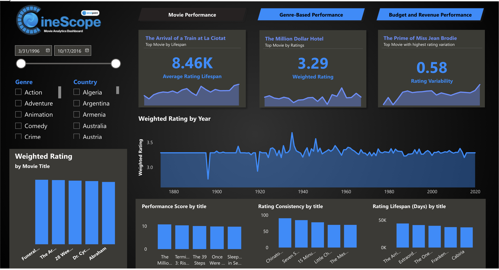

# CineScope-Movie-Analytics-Dashboard

This project features a dynamic Movie Analytics Dashboard powered by an ETL pipeline structured using the Medallion Architecture (Bronze → Silver → Gold layers). It extracts, transforms, and analyzes movie-related data to deliver insightful visualizations and KPIs on movie trends, genres, ratings, and more.

**Key Features:**

**Bronze Layer:** Raw ingestion of movie datasets from various sources using Delta Lake

**Silver Layer:** Cleansed and enriched data with structured formats using Apache Spark

**Gold Layer:** Aggregated, analytics-ready data optimized for dashboarding using Pandas and MySQL database

**Interactive Dashboard:** Visual insights on genres, release trends, top-rated movies, etc. using Power BI

#### Previews

